# Architecture Overview

The implementation follows a compliance-first pipeline:

1. **Trend Intel** (`src/orchestrator/trend_intel.py`)
2. **Research Router + Grounding** (`src/research/research_router.py`, `src/research/grounding.py`)
3. **Niche Planner** (`src/orchestrator/niche_planner.py`)
4. **Story + Script Generation** (`src/content/story_builder.py`, `src/content/script_builder.py`)
5. **Model Provider Router** (`src/media/model_router.py`)
6. **Video Generation Service + Provider Adapters** (`src/media/video_generation_service.py`, `src/media/providers/`)
7. **Media Factory** (`src/media/factory.py`)
8. **Pre-upload Compliance** (`src/compliance/pre_upload.py`)
9. **Upload Time Scheduler** (`src/orchestrator/upload_scheduler.py`)
10. **YouTube Uploader** (`src/youtube/uploader.py`)
11. **Post-upload Monitor** (`src/youtube/monitor.py`)
12. **Remediation Engine** (`src/compliance/remediation.py`)
13. **Stores and Event Logs** (`src/storage/job_store.py`, `src/storage/token_store.py`, `src/storage/event_logger.py`)
14. **Metrics Collector** (`src/orchestrator/metrics_collector.py`)

## Flow

```mermaid
flowchart LR
    trendIntel[TrendIntel] --> researchRouter[ResearchRouter]
    researchRouter --> nichePlanner[NichePlanner]
    nichePlanner --> storyScript[StoryAndScriptBuilders]
    storyScript --> modelRouter[ModelProviderRouter]
    modelRouter --> videoService[VideoGenerationService]
    videoService --> mediaFactory[MediaFactory]
    mediaFactory --> preUpload[PreUploadCompliance]
    preUpload --> scheduler[UploadScheduler]
    scheduler --> uploader[YouTubeUploader]
    uploader --> monitor[PostUploadMonitor]
    monitor --> remediation[RemediationEngine]
    monitor --> metricsCollector[MetricsCollector]
    metricsCollector --> stores[JobStoreAndEventLogger]
```

## Data flow

- `config/*.yaml` define channels, niches, and deployment options.
- Text generation config uses `config/text_provider_strategy.yaml` + `config/text_api_keys.local.yaml`.
- Research config uses `config/research_provider_strategy.yaml` + `config/research_api_keys.local.yaml`.
- `src/main.py plan` creates jobs and persists them in `data/jobs.db`.
- Model selection uses `config/model_provider_strategy.yaml` + `config/model_api_keys.local.yaml`.
- `src/main.py run-once` runs planning + upload/monitor loop.
- `src/main.py collect-metrics` captures current YouTube video snapshots into DB and JSONL.
- Preview/debug commands are available: `research-preview`, `script-preview`, `render-preview`.
- Failed technical processing is remediated via re-encode.
- Policy-risk outcomes are routed to human review.
